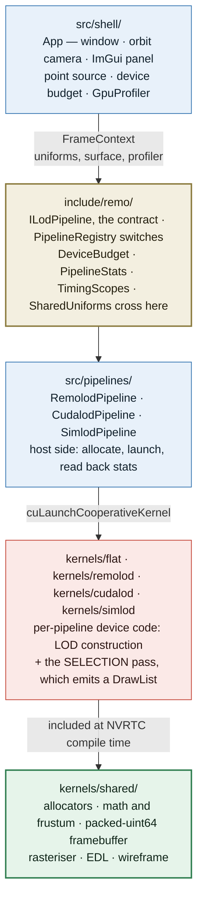
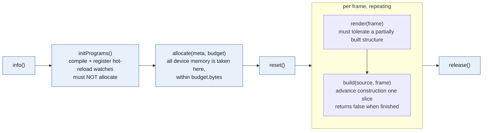

# Codebase overview

This is the orientation document for the code as it stands. [README.md](../README.md) says
what the project is *for* and what the research claim is; [CLAUDE.md](../CLAUDE.md) lists the
rules and the traps. This file explains **how the program is put together** — the layers, the
seams between them, what happens in one frame, and where the unbuilt work plugs in.

Roughly 19k lines across `include/`, `src/` and `kernels/`, of which about a third is
vendored device code kept byte-identical to upstream.

---

## 1. The one-paragraph shape

RemoBench is a single-window point cloud viewer whose LOD algorithm is a **swappable plugin**.
The shell owns everything that is not LOD — window, camera, loader, device-memory budget,
software rasteriser, timing — and hands all of it, unchanged, to whichever pipeline is
active. Four pipelines exist: `flat` (no LOD, the control), `remolod` (RemoBench's own, and
what the research is about), `cudalod` (batch build) and `simlod` (progressive build). The
last two are **external comparison baselines**, vendored byte-identical and never edited --
RemoLOD forks what it needs out of them instead. Device code is compiled at **runtime** by NVRTC, so kernels
hot-reload on save. The whole arrangement exists so that a difference between two pipelines
is attributable to the LOD algorithm and nothing else.



The layering rule is one-directional and load-bearing: **`kernels/shared/` is included by
every pipeline and must never learn which pipeline included it.**

---

## 2. One frame, end to end

`App::run` ([src/shell/App.cpp](../src/shell/App.cpp)) drives `GLRenderer::runFrame(update,
render)`. Per frame:

| step | what happens | where |
| --- | --- | --- |
| 1 | apply a deferred cloud load, then a deferred pipeline switch | `App::applyPendingLoad`, `applyPendingPipelineSwitch` |
| 2 | `profiler.beginFrame(frame, regime, stream)` — harvests whatever GPU events completed | [GpuProfiler.h](../include/remo/GpuProfiler.h) |
| 3 | build `SharedUniforms` from the camera and the shared settings | `App::buildUniforms` |
| 4 | latch the **frozen** transform if `update visibility` is off | `App::run` |
| 5 | resize + register the GL colour attachment as a CUDA surface | [GLInterop](../src/cuda/GLInterop.cpp) |
| 6 | `pipeline->render(frame)` — one cooperative launch: select → rasterise → EDL → resolve | `kernels/*/[id]_render.cu` |
| 7 | `pipeline->build(source, frame)` — advance construction by one slice | `src/pipelines/*.cpp` |
| 8 | `profiler.endFrame()` — blocking in the strict regime, another query pass otherwise | |
| 9 | ImGui panel; optionally `--dump-frame` and exit | [SettingsPanel.cpp](../src/shell/SettingsPanel.cpp) |

Two ordering decisions are deliberate:

- **Render before build.** Both are on the null stream so they serialise anyway; this way a
  frame shows the structure as of the previous build step rather than stalling on this one.
- **Loads and pipeline switches are deferred to the top of the next frame.** `drawGui` holds
  a raw `ILodPipeline*` across its whole body, and a switch destroys that object. Applying
  inline crashed on the first click, which is why the path is also reachable from the command
  line (`--switch-to` / `--switch-after`).

---

## 3. The four seams

Everything interesting in the design is one of four boundaries.

### 3.1 `SharedUniforms` — the host/device contract

[include/remo/HostDeviceCommon.h](../include/remo/HostDeviceCommon.h) is the *only* header
shared between host C++ and NVRTC. It holds camera, viewport, LOD budget and shading toggles
— knobs that are identical for every pipeline on every frame. Pipeline-specific tunables stay
on the pipeline. Two rules keep it working: no host-only includes (NVRTC has no libstdc++),
and identical layout on both sides (hence `int32_t` rather than `bool`).

It also carries `transformFrozen`: LOD selection is evaluated against a frozen camera when
`update visibility` is off, so you can lock the cut and fly around to inspect it.

The house rule is that **every field is read by device code.** Upstream ships six uniforms no
kernel reads, including an EDL toggle that does nothing — in a measurement tool a dead knob
invalidates experiments rather than merely being untidy.

### 3.2 `DrawList` + Walker — the LOD/rasteriser seam

[kernels/shared/remo_draw.cuh](../kernels/shared/remo_draw.cuh). A pipeline decides *which*
nodes to draw and appends a `DrawItem` per node. Everything downstream — projection,
splatting, the depth test, EDL, the resolve — is shared.

`DrawItem` carries node geometry, not just samples, because colour-by-node and colour-by-LOD
need an identity and a level, and the wireframe needs the box. It also carries
`voxelOctantMask`: an inner node's voxels summarise its whole subtree, so octants where a
child is *also* being drawn are redundant.

> The mask's bit order is the shared convention — **x is bit 0, y bit 1, z bit 2.** CudaLOD
> indexes its children in exactly the reverse order, so its selection pass permutes. Getting
> that wrong renders as large holes while the tree is provably correct.

Sample storage differs irreconcilably between the two references:

| pipeline | leaf points | inner-node voxels | walker |
| --- | --- | --- | --- |
| `flat` | contiguous slice of the input array | none | `RemoContiguousWalker` |
| `cudalod` | contiguous slice of one globally counting-sorted array | contiguous | `RemoContiguousWalker` |
| `simlod` | linked list of 1000-point `Chunk`s | separate chunk list | `RemoChunkedWalker<Chunk, 1000>` |

Rather than flatten to spans (~160 MB of descriptors rebuilt per frame) or branch on a
runtime `kind` on the hottest loop in the renderer, the pipeline supplies a **Walker type**
resolved at NVRTC compile time. Zero dispatch cost, and each pipeline's structs stay
unmodified — which matters, because those structs are what is validated against
`bench/reference/`.

Rasterisation is one workgroup per `DrawItem`, blocks claiming items by striding over
`blockIdx.x`. Node sample counts vary by orders of magnitude, so a static partition would
leave most blocks idle; striding also keeps the Walker block-uniform and is deterministic,
which golden images need.

### 3.3 `ILodPipeline` — the plugin contract

[include/remo/ILodPipeline.h](../include/remo/ILodPipeline.h). Lifecycle:



- `initPrograms()` compiles and registers hot-reload watches; it must **not** allocate.
- `allocate()` is where all device memory is taken, within `budget.bytes`.
- `build()` advances construction by one slice and returns `false` when finished.
- `render()` must tolerate a partially built structure.
- `timingScopes()` declares the profiler scope names — see §6.

Each pipeline keeps its **own** device-side stats struct as close to upstream as possible
(SimLOD's `Stats`, CudaLOD's `Results`) and translates into `PipelineStats` on the host.
Rewriting those device structs to a common shape would mean editing the kernels being
validated.

`PipelineStats` carries three health flags — `memCapacityReached`, `nodeCapacityReached`,
`allocOverflow`. Any of them set means the structure was silently truncated and the run is
not a valid data point.

**Why one compiled module set per pipeline** rather than a switch inside a shared kernel: two
independent constraints force it. Every kernel is a cooperative launch using
`cg::this_grid().sync()`, and two pipelines' kernels cannot be composed into one launch;
and the device bump allocator requires uniform control flow (§5), so an allocation can never
sit behind a pipeline-selected branch. Both push selection up to the module level, and sharing
happens instead at compile time through `#include`.

### 3.4 `PointSource` — the ingest seam

[include/remo/PointSource.h](../include/remo/PointSource.h). One loader serves both consumer
shapes, via a small trick: **a whole-cloud consumer is the streaming ring with non-wrapping
slot addresses.**

```text
Mode::Stream → deviceAddr(k) = ringBase     + (k % numSlots) * slotBytes
Mode::Whole  → deviceAddr(k) = residentBase +  k             * slotBytes
```

Everything else — header scan, loader threads, per-slot `batchSizes[]`, `numBatchesUploaded`
— is identical. `SimlodPipeline` therefore gets genuinely progressive construction across
frames from an already-resident cloud: `kernel_construct` does not care that the points are
all there, it just walks batches. That isolates construction cost from streaming cost, which
is a legitimate measurement mode but **not** the paper's loading/generation overlap claim.

Coordinates are pre-translated on the host so the box minimum sits at the origin and device
code never needs doubles. The translation is exactly `-boxMin`, because the octree root cube
is sized from `boxSize` with its minimum *assumed* to be the origin — it used to snap down to
a power of two, which left a UTM cloud 169 km off origin and collapsed 36M points into 29
nodes. A reader holding f64 coordinates applies it in f64 and narrows afterwards; that is
what buys sub-millimetre resolution on a cloud whose raw coordinates only have ~4 cm of f32
resolution.

Three readers exist, plus `makeSyntheticSource`: `readSimlod`
([src/io/RawReader.cpp](../src/io/RawReader.cpp), ~100 MP/s, zero parsing — the on-disk
record *is* our `Point`), `readLasPoints`
([src/io/LasReader.cpp](../src/io/LasReader.cpp), ~110–140 MP/s across eight loader threads)
and `readLazPoints` ([src/io/LazReader.cpp](../src/io/LazReader.cpp), laszip, ~5 MP/s and
sequential). All three produce bit-identical trees and byte-identical frames from the same
cloud, which is the only real check any of them has.

---

## 4. The four pipelines side by side

| | `flat` | `remolod` | `cudalod` | `simlod` |
| --- | --- | --- | --- | --- |
| role | control / ground truth | **ours — the research** | comparison, batch | comparison, progressive |
| may be edited | rarely | yes, freely | **no** | **no** |
| residency | whole cloud | whole cloud (for now) | whole cloud required | streams batches into a live tree |
| build | nothing; latches a pointer | one bounded launch per frame + accumulate | 2 cooperative launches, one shot | one bounded launch per frame |
| structure | none | octree, 128³ 1-bit occupancy grid + `NodeAccum[]` | octree, counting-sort split to depth 12 | octree, 128³ 1-bit occupancy grid per inner node |
| sample storage | array slices | chunk lists | contiguous slices | chunk lists |
| selection | every 64k slice is visible | disjoint frontier, no mask needed | parent *and* children visible, octant-masked | disjoint frontier, no mask needed |
| draw list capacity | 32,768 | 131,072 | 65,536 | 131,072 |
| point ceiling | none | none | fits in budget | **50M** (upstream's batch ring; see §11) |
| scopes | `flat.render` | `remolod.reset`, `remolod.construct`, `remolod.accumulate`, `remolod.render` | `cudalod.split`, `cudalod.voxelize`, `cudalod.render` | `simlod.reset`, `simlod.construct`, `simlod.render` |

`flat` is deliberately the smallest possible `ILodPipeline` and is the reference for writing a
new one. It is also not a placeholder: it is the image-quality ground truth, the upper bound on
samples drawn, the only run-to-run deterministic pipeline, and it exercises the entire shared
path before any octree exists to confuse a bug with. It goes through the same `DrawList` seam
rather than a private fast path, so the seam is tested by the control condition.

`remolod` is a fork of `simlod` plus the accumulator, and its octree kernel is currently
line-for-line SimLOD's apart from two constants (`BATCH_STREAM_SIZE`, `MAX_NODES_CAPACITY`).
That is the intended starting point: the two pipelines build identical trees today, so any
difference between them is attributable to the passes around construction. Refinement is what
will make the fork diverge, and the diff against `kernels/simlod/` is what will explain how.

**The two selection metrics are not yet interchangeable.** Both accept `lodPixelBudget`, but
SimLOD's pass projects all eight corners and takes the screen AABB while CudaLOD's estimates
from the node centre, so they do not interpret the budget identically. Each kernel still
carries its native metric behind `REMO_LOD_SIMLOD_NATIVE` / `REMO_LOD_CUDALOD_NATIVE` for
validating a port against published behaviour, but no host code populates
`KernelProgramDesc::defines`, so that path is currently unreachable.

`cudalod` faults on the synthetic fixture with `CUDA_ERROR_ILLEGAL_ADDRESS` in the split
kernel. `PipelineRegistry::unsupportedReason` refuses it for that input on purpose — a device
fault kills the context outright, so a single GUI click would otherwise take the session down.

---

## 5. Device memory and the two allocators

The shell computes **one** `DeviceBudget` — `0.85 × (freeAtStartup − 512 MB)` — and hands the
same number to every pipeline. This replaces two upstream land grabs (SimLOD takes 80% of
whatever happens to be free; CudaLOD takes a hardcoded slab). Neither is a budget, and the
first makes a run depend on what else was on the GPU at the time.

Switching pipelines is **exclusive**: the outgoing one releases before the incoming one
allocates, so both are offered the same bytes. There is no way to hand SimLOD's chunked
octree to CudaLOD's contiguous-slice traversal anyway — a switch always means rebuild.

[kernels/shared/remo_alloc.cuh](../kernels/shared/remo_alloc.cuh) has two allocators:

- **`RemoAllocator`** — per-launch scratch, **non-atomic on purpose.** Every thread constructs
  it from the same base and walks the identical allocation sequence, so all threads derive
  identical pointers with zero atomics and zero broadcast. The price is a hard requirement:
  *every thread must execute every `alloc()` call, in the same order.* No `alloc()` inside
  `if (threadIdx.x == 0)`, behind a data-dependent condition, or in a loop with a varying trip
  count. `-DREMO_ALLOC_DEBUG=1` checks it at runtime.
- **`RemoAllocatorGlobal`** — atomic, for state persisting across launches (the LOD structure).
  Lives inside the buffer it manages.

Both have a **capacity and a bounds check**, which upstream does not, and overflow reports
itself into `DeviceDiagnostics` (read back every frame) rather than returning a wild pointer.
This is not hypothetical: SimLOD's momentary allocator hands out ~409 MB from a 300 MB buffer,
so `chunkQueue`'s base pointer lands entirely outside the allocation. It only "works" because
the preceding arrays are never filled near capacity.

---

## 6. Measurement

Timing is **shell-owned**, per Stage 1 of [plans/02_ProfilingTools.md](../plans/02_ProfilingTools.md).

- **Every kernel launch sits inside a `GpuScope`** taken from `FrameContext::profiler`. A
  launch outside one does not appear in any total. `ILodPipeline::timingScopes()` declares the
  names, so a pipeline that adds a phase without declaring it silently stops being counted —
  the one way back into the defect this layer removed.
- **A scope with no samples is absent, not `0.00`.** `GpuProfiler::find()` returns null,
  `timingRow()` prints "not measured", `BuildTotals::measured` says so. Previously
  `SimlodPipeline::render` and `CudalodPipeline::render` never recorded anything and the GUI
  printed a plausible `0.00` in the same format as a real measurement.
- **Two regimes, never pooled.** `--strict-timing` synchronises and attributes a sample to the
  frame that produced it; the default harvests whenever `cuEventQuery` says ready. Samples are
  filed under the regime that produced them. Name the regime whenever quoting a number.
- The profiler keeps a **distribution** — Welford mean/variance plus a 4096-sample ring for
  order statistics — not a running sum. A progressive builder produces a long tail by
  construction, so a mean over frame times is dominated by it.
- **Scope names are the data format** (`simlod.construct`, `cudalod.voxelize`, …). They become
  column names in the benchmark output; renaming one breaks comparison against captured runs.

`--dump-frame` prints the full per-scope table alongside the structural counts, which is what
a scripted run asserts on. That table reproduces the CudaLOD reference numbers for strategy 0
within ~2% (split 4.99 ms against 5.1, voxelize 4.08 against 4.1) — the oracle saying the
instrument itself is right. See [bench/reference/README.md](../bench/reference/README.md).

---

## 7. Runtime kernel compilation

**No `.cu` is compiled at build time.** CUDA is not even enabled as a CMake language. Every
kernel under `kernels/` is compiled by NVRTC at runtime and linked with nvJitLink, which is
what makes hot reload work — edit a `.cu` or `.cuh`, save, and the next frame runs it. A
broken kernel is non-fatal and leaves the previous version live.

The consequence is the single most important thing to know about working here:

> **A successful `make` does not mean the kernels compile.** After touching anything under
> `kernels/`, run `./build/remobench --check-kernels`. It needs no display, GPU context or
> point cloud.

[CudaModularProgram](../include/remo/CudaModularProgram.h) keeps upstream's API shape —
construct with modules and kernel names, get `CUfunction`s back, every module watched — and
rewrites the implementation: a failed compile is non-fatal, leaks are fixed, the target
architecture is queried from the device rather than read from an env var, and compiled
LTOIR/PTX is cached on disk keyed on source text plus the full option set.

One NVRTC option surprises every reader: **`-default-device`** makes unannotated functions
implicitly `__device__`, which is why the kernel sources carry no `__device__` markers and read
like plain C++. Inherited from upstream and kept, but it means these files will *not* compile
under `nvcc` as-is.

Each pipeline declares its link groups in a **`programs.txt`**, which `--check-kernels` reads.
This exists because most of CudaLOD's `.cu` files are `#include` fragments that are not
independently compilable — scanning for `.cu` files reports pages of errors about code that is
perfectly fine in context, and filenames do not distinguish the two cases.

`kernels/` is **symlinked** next to the binary, never copied: a `POST_BUILD` copy goes stale
the moment you edit a kernel without relinking, and you end up hot-reloading a file the
running program is not reading. An absolute `REMOBENCH_KERNEL_DIR` is also baked in so a run
from any cwd finds its kernels.

---

## 8. `kernels/shared/` file by file

Included as one unit via `shared/remo_pipeline.cuh`.

| file | contents |
| --- | --- |
| `remo_pipeline.cuh` | the single include a pipeline needs; pulls the rest in dependency order |
| `remo_prelude.cuh` | cooperative groups, grid-stride helpers (`processRange`, `processRangeStrided`), `remoNanotime`, colour hashing |
| `remo_alloc.cuh` | the two bump allocators (§5) |
| `remo_math.cuh` | row-major `mat4` multiply, projection, `Frustum` culling — glm does not go through NVRTC cleanly |
| `remo_framebuffer.cuh` | the packed-`uint64` framebuffer, point splatting, EDL, the surface resolve |
| `remo_draw.cuh` | `DrawItem` / `DrawList`, the Walkers, `remoRasterizeDrawList` |
| `remo_lines.cuh` | the octree wireframe overlay |

**The framebuffer packing is load-bearing.** One `uint64` per pixel holds
`(float depth << 32) | rgba`, and a single 64-bit `atomicMin` resolves both the depth test and
the colour write. Splitting it into separate depth and colour buffers doubles atomic traffic on
the hottest path and races the two writes. It works because for non-negative IEEE-754 floats
the bit pattern orders like the value — which is why `remoProject` *rejects* `w <= 0` rather
than clamping.

Note that the shared path is what makes the comparison possible at all. Upstream's two
renderers differ in ways unrelated to LOD: SimLOD uses this packed `uint64` with a
divide-by-count resolve, CudaLOD a `uint32` depth buffer plus a 16 byte/pixel accumulator with
a Gaussian 3×3 splat resolve. Feed those the same octree and the images still differ.

**The wireframe** (`--show-bounds`, `--hide-points`) draws one cube per emitted `DrawItem`,
coloured by level with the same hash colour-by-LOD gives the samples, so a node's box and its
contents match. It draws the *cut* rather than inferring it from sample colours, which makes
the selection difference directly visible: SimLOD's frontier tiles disjointly, CudaLOD's
parent-and-child visibility nests. There is no `Lines` buffer — one thread per cube *edge*,
straight from `DrawItem` to pixels, because a 131k-item frontier would otherwise want ~50 MB
of vertices to describe cubes derivable from a few bytes each. It is drawn after EDL so the
overlay is not lit by its own edges, and depth-tested through the shared framebuffer so an
edge behind a surface is hidden by it.

---

## 9. Verification surface

There is **no test suite yet** — `tests/unit/` is empty and `REMOBENCH_BUILD_TESTS` is OFF, so
`make test` runs ctest against nothing. What exists instead:

| tool | what it checks |
| --- | --- |
| `--check-kernels` | every declared program compiles and links, headlessly |
| `--dump-frame <ppm>` | headless frame capture plus the structural/timing readout |
| `--dump-ui` | captures the presented backbuffer with ImGui, for inspecting the panel |
| `--list-datasets` | the dataset scan and the `.simlod` point counts, without a window |
| `--switch-to` / `--switch-after` | the runtime pipeline-switch path, from a script |
| `--show-bounds` / `--hide-points` | the structural view, from a script |
| `bench/reference/` | upstream structural counts and timings the ports are validated against |

The pattern to preserve: **a GUI-only code path is an untested code path.** Every control
should be reachable from the command line. CudaLOD's sampling strategy is the outstanding
violation — it is still GUI-only, so only strategy 0 of the reference oracle can be checked
from a script.

RemoBench also **fails fast on a device fault**, exiting and naming the kernel. Continuing
previously produced a cascade of errors, then host heap corruption, then a SIGSEGV in a
file-watcher thread — a trail pointing nowhere near the cause.

---

## 10. Where the unbuilt work lands

It all lands in **`kernels/remolod/`** — RemoLOD is the pipeline the research is about, and
`simlod`/`cudalod` are comparison baselines that stay byte-identical to their submodules.

The project is five kernels. Three exist; the last two are the work.

| kernel | when | state |
| --- | --- | --- |
| Rasterize | every frame | exists — `kernels/remolod/remolod_render.cu` |
| Update | on batch completion | exists — `kernels/remolod/remolod_octree.cu` |
| Accumulate | after each Update | exists — `kernels/remolod/remolod_accum.cu` |
| **Analysis** | every frame, per node | **to build** |
| **Refinement** | if budget remains | **to build** |

Analysis is cheap, unconditional and does not mutate the tree. Refinement is the only thing
that mutates it and the only thing that consumes budget — which is what makes "how much
refinement budget the system got" the single independent variable of the evaluation. Keep
that separation.

Constraints the code already imposes on that design, established by reading it:

- **Per-node accumulators do not belong on `Node`.** `Node` is 152 bytes and its size is
  mirrored host-side as `kNodeBytes` to size the 200k-node pool; widening it also costs the
  render kernel's hot traversal its 8-nodes-per-cache-line layout, for data that traversal
  never reads. Use the side array — `NodeAccum`, `remo/RemoAccum.h`.
- **Anything that only reads the tree should be a separate launch.** The accumulator was a
  hook inside `kernel_construct` and is now its own kernel over the finished tree. That is
  what keeps the baselines byte-identical, and it was also cheaper: no octree descent per
  point, one uncontended write per leaf, and its own timing scope. Reach for this shape first.
- **Colour averaging has a memory wall.** The occupancy grid is 1 bit per cell — 256 KB per
  inner node at 128³. An RGBA-sum grid at the same resolution is ~16 MB *per node*. Filtering
  needs a sparse accumulator keyed off the voxel backlog.
- **Collapsing needs a grid pool first.** Point/voxel chunks already recycle through
  `chunkQueue`, but the 256 KB `OccupancyGrid` allocated on split is never freed — there is
  nothing to return it to.

Read [plans/01_NoveltyAssessment.md](../plans/01_NoveltyAssessment.md) before touching LOD
selection metrics, node budgets or split criteria.

---

## 11. Invariants

The short list of things that break the project rather than merely the build.

1. **The shared path stays shared.** One loader, one camera, one rasteriser, one pixel budget,
   one device budget, handed unchanged to every pipeline. A pipeline that genuinely needs
   different behaviour is a finding to surface, not a special case to add.
2. **`flat` is not dead code.** It is the control condition and the image-quality ground truth.
3. **Uniform control flow around `RemoAllocator`.** Every thread, every `alloc()`, same order.
4. **Every launch inside a `GpuScope`, every scope in `timingScopes()`.** Otherwise it is not
   counted anywhere.
5. **Scope names are stable.** Renaming one breaks comparison against captured runs.
6. **Vendored device code stays byte-identical**, and `make check-vendored` enforces it.
   `simlod` and `cudalod` are comparison baselines; they are worth having only while they
   still reproduce their published numbers. RemoLOD **forks** into `kernels/remolod/` rather
   than editing them, and notes about a vendored file go in
   [kernels/simlod/VENDORED.md](../kernels/simlod/VENDORED.md), not in the file. Check
   [THIRD_PARTY.md](../THIRD_PARTY.md) before copying anything new — one upstream file is
   CC BY-NC-SA and is deliberately unused.
7. **`make check` after any `kernels/` change** — and remember that compiling is not
   launching. `--check-kernels` links every program but launches none, so it cannot see a
   host/device signature mismatch. Pass kernel arguments as one shared struct (`AccumArgs`)
   to make that class of mistake unrepresentable.
8. **Fail fast on device faults.** Do not add a "continue anyway" path.
9. **Nothing GUI-only.** New controls get a command-line route.
10. **Never quote a throughput figure without naming the regime**, and for CudaLOD the sampling
    strategy — `WEIGHTED_NEIGHBORHOOD` voxelizes ~13× slower than `FIRST_COME` for a
    bit-identical tree.

---

## 12. Where to look next

| question | file |
| --- | --- |
| what is the pipeline contract | [include/remo/ILodPipeline.h](../include/remo/ILodPipeline.h) |
| how do I write a pipeline | [src/pipelines/FlatPipeline.cpp](../src/pipelines/FlatPipeline.cpp) + [kernels/flat/flat_render.cu](../kernels/flat/flat_render.cu) |
| which pipelines may I change | [CLAUDE.md](../CLAUDE.md#the-four-pipelines-and-which-ones-you-may-touch), [kernels/simlod/VENDORED.md](../kernels/simlod/VENDORED.md) |
| what crosses to the device | [include/remo/HostDeviceCommon.h](../include/remo/HostDeviceCommon.h) |
| how does selection reach the rasteriser | [kernels/shared/remo_draw.cuh](../kernels/shared/remo_draw.cuh) |
| how is timing recorded | [include/remo/GpuProfiler.h](../include/remo/GpuProfiler.h), [plans/02_ProfilingTools.md](../plans/02_ProfilingTools.md) |
| how does ingest work | [include/remo/PointSource.h](../include/remo/PointSource.h) |
| how does hot reload work | [include/remo/CudaModularProgram.h](../include/remo/CudaModularProgram.h) |
| what is the research claim | [plans/01_NoveltyAssessment.md](../plans/01_NoveltyAssessment.md) |
| what are the baseline numbers | [bench/reference/README.md](../bench/reference/README.md) |
| what is vendored from where | [THIRD_PARTY.md](../THIRD_PARTY.md) |
