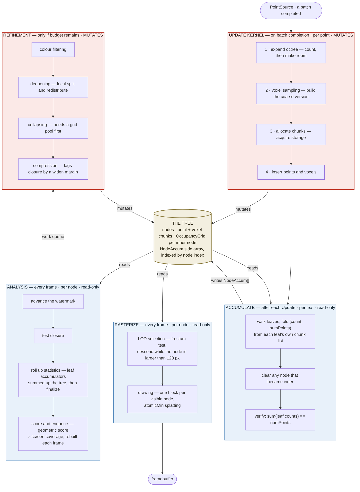

# The kernel pipeline

Four kernels, three cadences. This page is the map of the detail-aware pipeline: what each
kernel does, how often it runs, what it is allowed to touch, and which parts exist today.
[01_Overview.md](01_Overview.md) explains how the program is put together;
[plans/01_NoveltyAssessment.md](../plans/01_NoveltyAssessment.md) says why this shape is the
research claim.

Everything here is **RemoLOD's** — `kernels/remolod/`. The `simlod` and `cudalod` pipelines
are external comparison baselines, vendored byte-identical and never edited; RemoLOD forked
what it needed out of SimLOD and changes the fork. See
[CLAUDE.md](../CLAUDE.md#the-four-pipelines-and-which-ones-you-may-touch).

The first three kernels exist. The last two are the project.

| kernel | cadence | granularity | mutates the tree | state |
| --- | --- | --- | --- | --- |
| [Rasterize](#1-rasterize) | every frame, unconditionally | per node | no | exists — [remolod_render.cu](../kernels/remolod/remolod_render.cu) |
| [Update](#2-update) | only if a batch completed | per point | **yes** | exists — [remolod_octree.cu](../kernels/remolod/remolod_octree.cu) |
| [Accumulate](#2b-accumulate) | after each Update | per leaf | no | exists — [remolod_accum.cu](../kernels/remolod/remolod_accum.cu) |
| [Analysis](#3-analysis-custom) | every frame, unconditionally | per node | no | **to build** |
| [Refinement](#4-refinement-custom) | only if budget remains | per node | **yes** | **to build** |

**The separation is load-bearing.** Analysis is cheap, unconditional and does not mutate the
tree. Refinement is the only thing that mutates it and the only thing that consumes budget —
which is what makes *how much refinement budget the system got* the single independent
variable of the evaluation. A change that lets Analysis mutate, or lets Refinement run
unbudgeted, destroys that.

---

## The shape

Two arrows carry the whole design. **Accumulate writes `NodeAccum[]` and nothing reads it
yet; Analysis reads it and writes only a score.** Everything downstream of that is budget
policy.

"Read-only" for Accumulate means *read-only with respect to the tree*. It writes the side
array and nothing else, which is why the structural counts must be identical with the pass on
and off — run `--remolod-no-accum` to check.

---

## 1. Rasterize

**Every frame, unconditionally. Per node. Does not mutate the tree.**

| step | what it does |
| --- | --- |
| LOD selection | frustum test, descend while the node projects larger than 128 px |
| drawing | one block per visible node, `atomicMin` splatting into the packed `uint64` framebuffer |

Selection emits a `DrawList`; the shared rasteriser in
[kernels/shared/](../kernels/shared/remo_draw.cuh) consumes it. Both are on the shared path
and stay that way — see the *shared path* section of [CLAUDE.md](../CLAUDE.md).

---

## 2. Update

**Only if a batch completed. Per point. Mutates the tree.**

| step | what it does |
| --- | --- |
| 1 — expand octree | count, then make room for the new points |
| 2 — voxel sampling | build the coarse version |
| 3 — allocate chunks | acquire the required storage |
| 4 — insert points and voxels | write everything |

[remolod_octree.cu](../kernels/remolod/remolod_octree.cu) is RemoLOD's fork of SimLOD's
`progressive_octree_voxels.cu`, currently line-for-line identical apart from the include of
`remolod_structures.cuh`. Refinement is what will change that; until it does, the fork's diff
against the baseline is empty and any difference between the two pipelines is attributable to
the passes around this kernel.

---

## 2b. Accumulate

**After each Update. Per leaf. Does not mutate the tree.**

| step | what it does |
| --- | --- |
| fold | for each leaf, add points `[count, numPoints)` into its running sums, then set `count = numPoints` |
| clear | zero any node that has become inner — inner statistics come from roll-up, not storage |
| verify | recompute `Σ leaf counts` and the count of inner nodes still holding sums |

Fifteen sums per node: nine geometry (`Σx Σy Σz`, `Σxx Σxy Σxz Σyy Σyz Σzz`) in `double`, six
colour in `float`, plus `n`. In **node-local coordinates**, which is the detail the whole
thing turns on — every metric downstream is a covariance and the answer depends on the
*smallest* eigenvalue, so summing raw UTM eastings destroys precisely the signal. Only leaves
accumulate; ancestors get their statistics by summation later, which is exact because
covariance sums are additive.

### Why it is a separate launch and not a hook

It used to be a seventh phase spliced into `addBatch()`, which meant editing vendored code.
That added two `kernel_construct` parameters the host never passed, and the SimLOD pipeline
silently built nothing for a whole commit. See [VENDORED.md](../kernels/simlod/VENDORED.md).

Pulling it out was better on the merits, not just tidier:

- **No octree descent.** The hook re-derived each point's leaf by walking 20 levels from the
  root, per point per batch, to rediscover where `insertPoints` had already put it. This pass
  iterates leaves and reads the points they already hold.
- **One uncontended write per leaf** instead of atomics per point. The hook needed warp
  aggregation to survive 36M atomic bursts, and that only pays when neighbouring threads share
  a leaf — which needs Morton-ordered input no reader here produces.
- **Separately measurable.** `remolod.accumulate` is its own scope; the hook's cost was buried
  inside `simlod.construct`.
- **Idempotent and interruptible**, because `NodeAccum::count` doubles as a watermark into the
  leaf's chunk list. A split resets the parent to `numPoints = 0` and hands its points to
  fresh children, so clearing the parent and letting the children walk from 0 re-accumulates
  the redistributed points exactly once.

Layout is [include/remo/RemoAccum.h](../include/remo/RemoAccum.h); the pass is
[kernels/remolod/remolod_accum.cu](../kernels/remolod/remolod_accum.cu); the design and its
staging are [plans/03_AccumulatorHook.md](../plans/03_AccumulatorHook.md).

### Acceptance

The pass writes only the side array, so the **structural counts must be identical with it on
and off** (`--remolod-no-accum`), and `Σ count` over leaves must equal `Stats::numPoints`.
`--dump-frame` prints both invariants. Frame byte-identity is *not* usable here: every octree
pipeline colours a voxel from the first point to reach its cell, so which thread wins makes
the image differ between two runs of the same binary.

Measured on `morro_bay_36M`: `36200706 / 36200706 ok`, `0` inner nodes with sums, ~2.5 ms per
launch against ~10 ms for construct, and 37,540,263 points folded against 36,200,706 stored —
the 3.7% excess being points re-walked after their leaf split.

---

## 3. Analysis (custom)

**Every frame, unconditionally. Per node. Does not mutate the tree.** — *to build*

| step | what it does |
| --- | --- |
| ~~advance the watermark~~ | already done — Accumulate maintains `AccumGlobals::mortonWatermark` |
| test closure | a node past the watermark can receive no further points, so its statistics are final |
| roll up statistics | leaf accumulators summed up the tree, then finalize |
| score and enqueue | geometric score × screen coverage, rebuilt each frame |

**One premise is not yet satisfied: nothing in RemoBench sorts points into Morton order.** Every
reader hands points to the device in file order, which for `.las`/`.laz` is acquisition order
along flight lines. So the watermark is well-defined and cheap but is **not yet a closure
oracle** — closure needs either a Morton-ordering stage in the loader or a different
criterion, such as `lastTouchedBatch` plus a batch-age margin. That decision belongs to the
Analysis plan; §3.5 and §9 of [plans/03_AccumulatorHook.md](../plans/03_AccumulatorHook.md)
record it rather than assume it away.

The score is rebuilt from scratch each frame, so nothing here is incremental state that can
drift.

---

## 4. Refinement (custom)

**Runs only if budget remains, and may produce no changes. Mutates the tree.** — *to build*

| step | what it does | blocked on |
| --- | --- | --- |
| colour filtering | average colour across a node's samples | needs a sparse accumulator keyed off the voxel backlog — a dense RGBA grid is ~16 MB *per node* |
| deepening | local split and redistribute | must keep `nodeCapacityReached` reporting intact — the node pool has no device-side capacity check |
| collapsing | merge a node back up | **needs a grid pool first** — the 256 KB `OccupancyGrid` allocated on split is never freed, and there is nothing to return it to |
| compression | lags closure by a widen margin | closure (§3) |

Every one of those constraints is recorded in the *constraints the detail-aware work runs
into* section of [CLAUDE.md](../CLAUDE.md); check it before designing against a different
assumption. The one that bites earliest is `RemoAllocator`'s uniform-control-flow rule —
no `alloc()` behind a data-dependent branch — which shapes how any of these passes can be
written.
